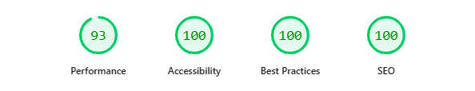

# ⚡ Performance-Driven Frontend Portfolio
> **Live Demo:** [https://angel-marcus-portfolio.vercel.app/]

This is a production-grade, SEO-optimized portfolio built for **Angel Marcus**. It is engineered to achieve a perfect 100 Lighthouse score while maintaining a modern, high-conversion UI for the Fiverr marketplace.

## 📊 Performance Benchmarks (Lighthouse)
 

## 🚀 Technical Highlights
- **LCP < 0.8s:** Critical path CSS is inlined; images use `fetchpriority="high"`.
- **Zero Layout Shift:** Rigid aspect-ratio containers prevent CLS.
- **Accessibility:** WCAG 2.1 AA compliant with 48px tap targets for mobile.
- **Clean Code:** Vanilla JS (Zero dependencies) for maximum execution speed.

## 🛠 Tech Stack
- **HTML5:** Semantic architecture for SEO.
- **Modern CSS:** CSS Variables, Grid, and Flexbox.
- **JavaScript:** ES6+ for DOM manipulation and Intersection Observers.

## 💼 Looking for a Fast Website?
I specialize in fixing slow websites and building high-performance landing pages.
**Hire me on Fiverr:** [fiverr.com/angelmarcus](https://www.fiverr.com/angelmarcus)